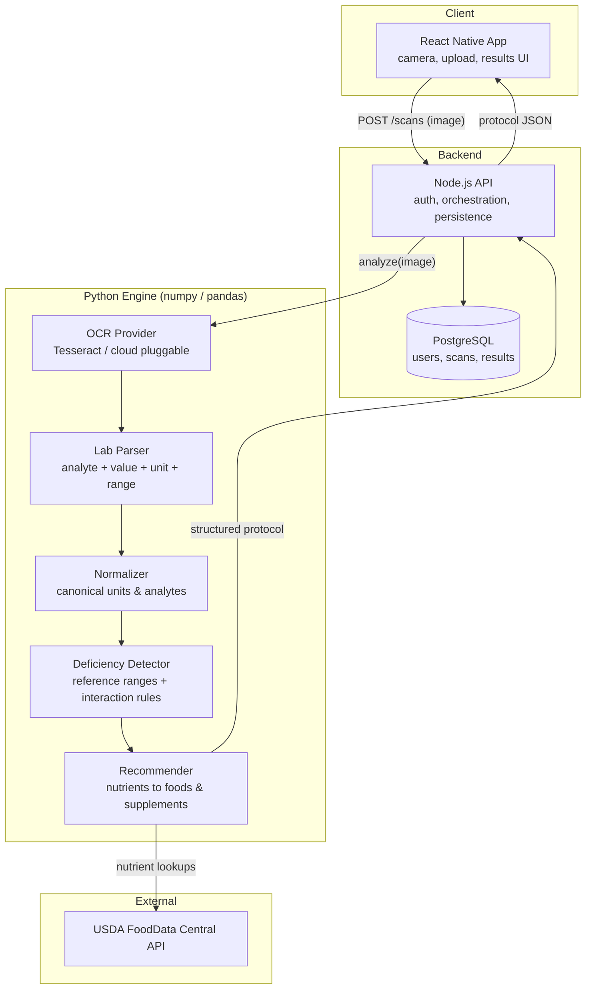
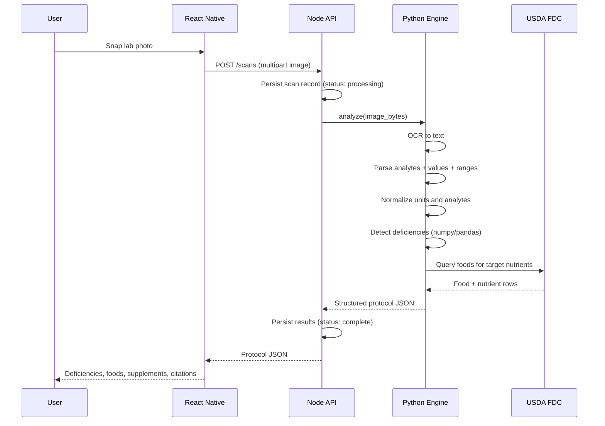
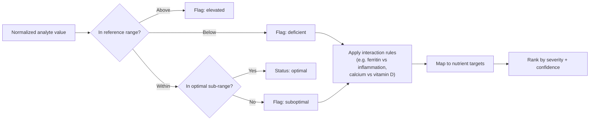

# LabOptimal

Snap a photo of your lab results, get back deficiency detection, supplement recommendations, and meal plans grounded in the USDA FoodData Central database.

LabOptimal is open source by design. Code is MIT, curated nutrient dossiers are CC BY 4.0. The goal is to make personalized nutritional analysis auditable, reproducible, and free to build on.

## What it does

1. You photograph a lab panel (CBC, CMP, micronutrient panel, etc.).
2. OCR extracts the raw text.
3. The engine parses analytes, values, units, and reference ranges out of that text.
4. Values are normalized to canonical units and mapped to canonical analytes.
5. Deficiency detection compares each value against reference ranges and applies interaction-aware rules.
6. Detected deficiencies are mapped to nutrients, then to foods (USDA FoodData Central) and supplement options.
7. You get a structured protocol: what you are low on, what to eat, what to supplement, and why, with citations.

## Architecture

LabOptimal is a polyglot monorepo with three services that talk over well-defined contracts. The split lets a Python data/science core do the analytical work while a Node service owns orchestration and persistence and a React Native app owns capture and display.



### Request lifecycle



### Deficiency detection flow



## Monorepo layout

```
labOptimal/
  services/
    engine/            Python analytical core (OCR, parsing, detection, recommender)
      src/laboptimal_engine/
      tests/
      requirements.txt
      pyproject.toml
    api/               Node.js REST API + PostgreSQL (Copilot lane)
    mobile/            React Native app (Copilot lane)
  docs/
    api-contract.md    Shared contract between engine, api, and mobile
    reference-ranges.md
  TASKS.md             Task split: Claude lane vs Copilot/GPT-5 lane
  README.md
```

## Contracts first

The three services integrate through two documents so the two build lanes can proceed in parallel without stepping on each other:

- `docs/api-contract.md` defines the JSON the engine returns and the API exposes.
- `docs/reference-ranges.md` defines the canonical analytes and reference-range schema the detector consumes.

Change a contract, and both lanes get the update in one place.

## Getting started (engine)

```bash
cd services/engine
py -m venv .venv
source .venv/Scripts/activate      # Windows Git Bash
pip install -e ".[dev]"            # editable install puts the package on the path
python -m laboptimal_engine.pipeline --demo
pytest
```

## License

- Code: MIT
- Nutrient dossiers and curated content: CC BY 4.0
- Hardware designs (elsewhere in the initiative): CERN OHL
