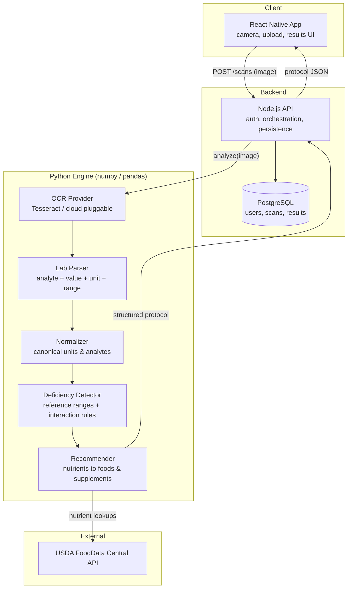
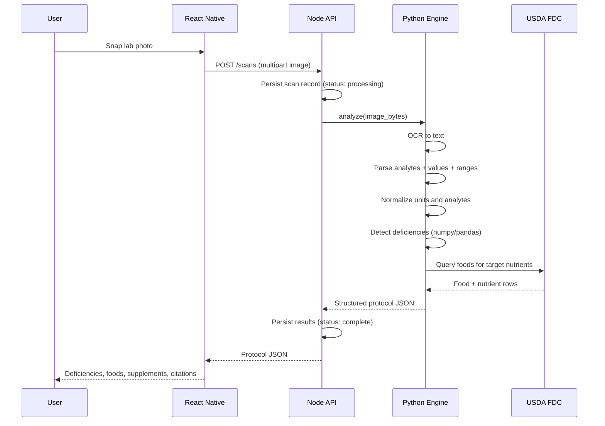
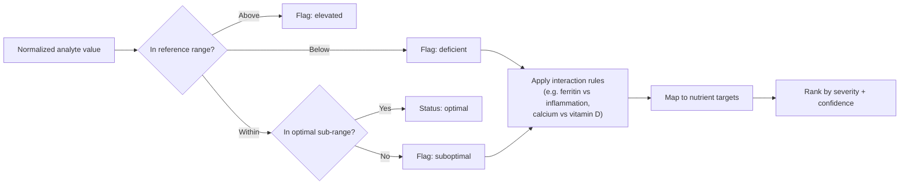

# LabOptimal

Snap a photo of your lab results, get back deficiency detection, supplement recommendations, and meal plans grounded in the USDA FoodData Central database.

LabOptimal is open source by design. Code is MIT, curated nutrient dossiers are CC BY 4.0. The goal is to make personalized nutritional analysis auditable, reproducible, and free to build on.

## What it does

1. You photograph a lab panel (CBC, CMP, micronutrient panel, etc.).
2. OCR extracts the raw text.
3. The engine parses analytes, values, units, and reference ranges out of that text.
4. Values are normalized to canonical units and mapped to canonical analytes.
5. Deficiency detection compares each value against reference and optimal ranges and applies interaction-aware rules (iron/ferritin/CRP, B12/folate, calcium/vitamin D, zinc/copper, and more). Each finding carries a confidence score with the reasons behind it.
6. Detected deficiencies are mapped to nutrients, then to foods ranked by nutrient density (USDA FoodData Central), supplement options with dossier-backed doses, and a deterministic 7-day meal plan.
7. You get a structured protocol: what you are low on, how sure the engine is, what to eat, what to supplement, and why — with citations for every reference range and dossier.

## Architecture

LabOptimal is a polyglot monorepo with three services that talk over well-defined contracts. The split lets a Python data/science core do the analytical work while a Node service owns orchestration and persistence and a React Native app owns capture and display.



### Request lifecycle



### Deficiency detection flow



## Monorepo layout

```
labOptimal/
  services/
    engine/            Python analytical core (OCR, parsing, detection, recommender)
      src/laboptimal_engine/
        parsing/ normalize/ deficiency/ recommend/ mealplan/ ocr/
        dossiers/        Curated nutrient dossiers (CC BY 4.0)
        data/            Reference ranges (cited)
        service.py       FastAPI /analyze sidecar
      tests/
      pyproject.toml
    api/               Node.js (Fastify) REST API + Prisma/PostgreSQL: auth, scans, history
    mobile/            React Native (Expo SDK 57) app: capture, auth, results, plan, history
  docs/
    api-contract.md       Shared contract between engine, api, and mobile
    reference-ranges.md   Canonical analytes + cited reference ranges
    nutrient-dossiers.md  Dossier schema + license
  docker-compose.yml   Local PostgreSQL
  TASKS.md             Build plan and status
  README.md
```

## Contracts first

The services integrate through three documents so work can proceed in parallel without stepping on each other:

- `docs/api-contract.md` defines the JSON the engine returns and the API exposes (findings with confidence + drivers, food suggestions with amounts, supplements with doses, the meal plan, and citations).
- `docs/reference-ranges.md` defines the canonical analytes and the cited reference-range schema the detector consumes.
- `docs/nutrient-dossiers.md` defines the dossier schema that backs supplement doses and citations.

Change a contract, and every service picks up the update in one place.

## Getting started (engine)

```bash
cd services/engine
py -m venv .venv                        # or: python -m venv .venv
source .venv/Scripts/activate           # Windows Git Bash
pip install -e ".[dev,service]"         # editable install + FastAPI service extras
python -m laboptimal_engine.pipeline --demo
pytest                                  # 29 tests
```

`--demo` runs the whole pipeline on a bundled panel and prints the protocol JSON
— the fastest way to see the contract shape.

## Running the app locally

The mobile app has two data paths, chosen by auth state:

- **Guest** — talks to the Python engine's `/analyze` directly. Needs only the
  engine. Great for demoing the analysis.
- **Signed in** — goes through the Node API: `POST /scans`, then polls
  `GET /scans/:id`, with persistence and history. Needs the full stack.

Two env vars point the app at its backends (defaults shown):
`EXPO_PUBLIC_ENGINE_URL` (engine, `http://localhost:8000`) and
`EXPO_PUBLIC_API_URL` (Node API, `http://localhost:3000`).

### Tier 1 — quick web (guest flow)

Engine + Expo, no database. Commands are Git Bash.

```bash
# Terminal A — engine (leave running)
cd services/engine
./.venv/Scripts/laboptimal-engine-serve.exe        # Uvicorn on http://0.0.0.0:8000

# Terminal B — mobile
cd services/mobile
npm install                                        # first time only
npx expo start
```

Press `w` for the browser (http://localhost:8081) → **Continue as guest** →
Upload. On the demo panel you should see **Ferritin as the priority finding**
(real engine). A score of **86** means the engine was unreachable and the app
fell back to bundled sample data — a banner says so.

### Tier 2 — full stack (auth + history)

Adds PostgreSQL + the Node API. Needs Docker Desktop.

```bash
# Terminal C — Postgres
cd /path/to/labOptimal
docker compose up -d

# Terminal D — Node API
cd services/api
cp .env.example .env
# point the engine subprocess at the engine venv's python (plain `python` may not be on PATH):
sed -i 's#ENGINE_PYTHON_CMD=python#ENGINE_PYTHON_CMD='"$PWD"'/../engine/.venv/Scripts/python.exe#' .env
npm install
npm run prisma:generate
npm run prisma:migrate
npm run dev                                        # http://localhost:3000
```

Keep the engine (Tier 1, Terminal A) and Expo running. In the app, **Create
account** → scan → **Account → Scan history** lists your scans.

### Tier 3 — on a phone

Point the app at your machine's LAN IP (find it with `ipconfig`), phone on the
same Wi-Fi:

```bash
cd services/mobile
export EXPO_PUBLIC_ENGINE_URL="http://<your-lan-ip>:8000"
export EXPO_PUBLIC_API_URL="http://<your-lan-ip>:3000"
npx expo start
```

Open in **Expo Go** (must support SDK 57 — update it if you hit an "unsupported
SDK" message), or build a standalone **dev client** that never needs SDK
matching:

```bash
npx eas-cli login
npx eas-cli build --platform android --profile development   # free; .apk
# iOS dev builds on a device require the paid Apple Developer Program
```

One-time firewall rules so the phone can reach the ports (admin PowerShell):

```powershell
New-NetFirewallRule -DisplayName "LabOptimal 8000" -Direction Inbound -LocalPort 8000 -Protocol TCP -Action Allow -Profile Private
New-NetFirewallRule -DisplayName "LabOptimal 3000" -Direction Inbound -LocalPort 3000 -Protocol TCP -Action Allow -Profile Private
```

> **OCR note:** photo scans need the Tesseract binary on the engine host. Without
> it, image analysis fails (text and `--demo` still work). Install Tesseract, or
> implement the `CloudOCRProvider`, to enable real photo uploads.

## License

- Code: MIT
- Nutrient dossiers and curated content: CC BY 4.0
- Hardware designs (elsewhere in the initiative): CERN OHL
